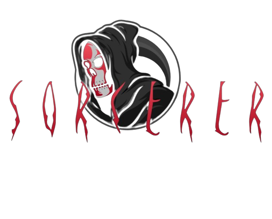
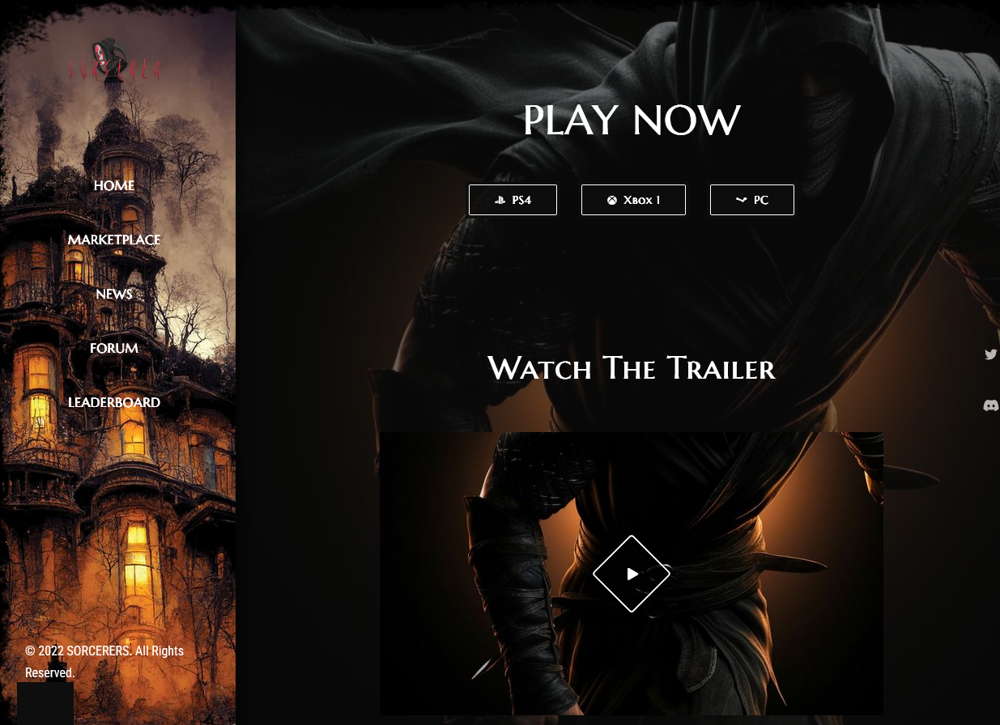
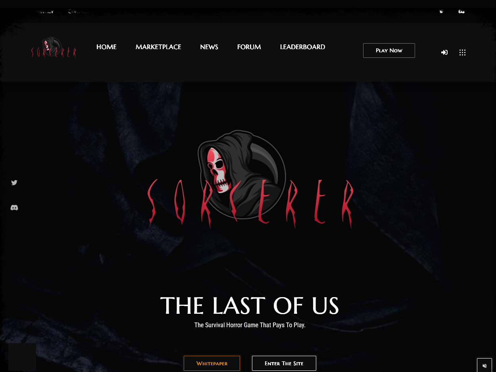
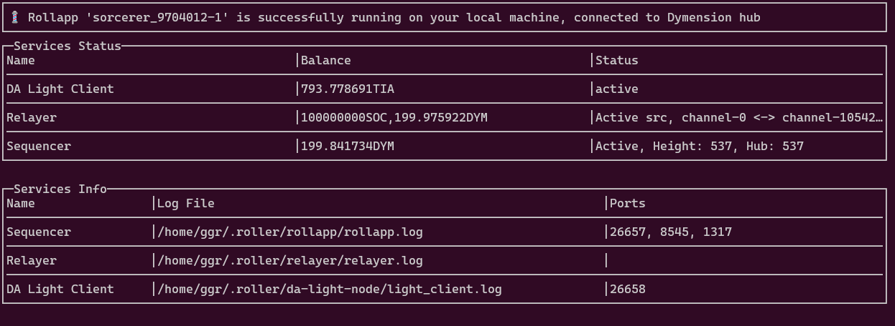

# SORCERER
### The Survival Horror Game That Pays To Play.

## Overview
Sorcerer is a multi-level blockchain horror game set in a decrepit Cathedral overlooking an abandoned Cemetry. It takes you into the heart-pounding world of hardcore gaming where colossal landscapes tower before you and every detail bursts with hyper-realistic intensity! Prepare to be thrust to the very brink of excitement as we push the boundaries to the absolute extreme, delivering an unparalleled gaming experience that will leave you breathless!  

## Website
Visit the website: [Live Version]()

## Video
Video Demostration: [Video Demo]()

## Pictures

## Technical Brief
### Web3/Blockchain components
- 5 smartcontracts on the sorcerer_9704012-1 rollapp
#### Contract Addresses
- `Sorcerer/NFT Contract: 0xAF74c39675fccCCfa587eb71B9A47831A1ffA627`
- `SocialReward Contract: 0xD8282F9a8D4Ece779EfF6B4b2aac8a64cE065EdE`
- `Leaderboard Contract: 0xe4Ee8fC5Dc0999ad98e9DD7889Aa9DFC38C2fF56`
- `Socerer Token Contract: 0xD8282F9a8D4Ece779EfF6B4b2aac8a64cE065EdE`
#### Blockchain
Sorcerer leverages [Dymension's](https://dymension.xyz/) network of easily deployable and lightning fast modular blockchains called RollApps. This approach solves three main GameFi problems: Speed, Interoperability and Security.

We have attempted to solve the other common problems in-game, which are:
- Weak or no element of enjoyable gaming due to emphasis on earning.
- Unsustainable game economic models.

### GAME
- Developed with the industry's leading game development tool, Unreal Engine 5.3.

### Other tools
- Solidity
- JavaScript
- IPFS/Filecoin
- Ethers
- HTML5
- CSS3
- Bootstrap

## Getting Started
Visit the website: [SORCERER]()
 
NB: The Rollapp- sorcerer_9704012-1 as at the time of this writing is not yet public. As a result of this, smart contract read and write may not be possible as of yet. However, video demonstration has been provided. Please see below details of the Sorcerer rollapp.
### Running Rollapp

- Click on the "Play Now" tab.
- Click the "Connect Wallet" button and connect with your metamask wallet by choosing an address to connect with. If metamask is not installed on your browser, you'll be prompted and redirected to the metamask download page.
#### Connect to the sorcerer_9704012-1 rollapp - Metamask
- Network Name: sorcerer_9704012-1
- Chain ID: 9704012
- RPC URL: http://127.0.0.1:8545/   (public RPC to be provided)
- Currency Symbol: SOC

### Creating a Game Asset
- Click the "Mint Now" button.
- There are on-screen instructions about the status of the transaction. 
- Upon successful confirmation of the transaction, proceed to download the game and enjoy. (Exclusive and private download link has been provided pre-release of the game)
- Ensure that you're connected to network described above to enjoy the full capabilities of the game.

## Game Objective
### Back Story
In the shadowy depths of a forsaken town, a sinister sorcerer has arrived, wielding dark magic to unleash terror upon the world. His twisted ambition? To pry open the ancient "Gate of Hell" sealed within a hidden shrine nestled deep within the heart of an abandoned cemetery.

As the sorcerer chants his unholy incantations, the very earth shudders and groans, and from the bowels of the underworld, legions of demons and zombies claw their way to the surface, their hungry eyes fixed upon the living.

But there's a slim barrier, a feeble defense against the tide of darkness—a crumbling outer gate, barely standing behind the decrepit Cathedral. It strains against the onslaught of evil, but its strength is waning, its iron bars threatening to yield to the relentless assault.

You, brave soul, are thrust into this nightmare, your fate entwined with the survival of humanity. Your mission: to hold the gate against the tide of malevolent creatures, to stand as a bulwark against the encroaching darkness.

Wave after wave crashes upon you, a relentless onslaught that threatens to overwhelm your senses and sanity. The air is thick with the stench of decay, the ground quaking beneath the weight of demonic footfalls. Every shadow hides a lurking horror, every whisper a promise of doom.

Yet you must steel yourself, for the gate's defenses are crumbling, its ancient wards failing under the strain of the sorcerer's dark magic. With each passing moment, the barrier weakens, its iron bars bending and twisting under the relentless assault.

When the gate finally falls, all hope seems lost. But in the depths of despair, a glimmer of defiance sparks within your soul. You will not go down without a fight. With every ounce of strength and cunning, you make a desperate bid for survival, carving a path through the throngs of demonic fiends that seek to claim your soul.

In this nightmarish realm, there is no sanctuary, no respite from the horrors that stalk your every step. Your only chance lies in your wits, your weapons, and your unyielding determination to defy the darkness and emerge victorious from the abyss. But remember, in the realm of nightmares, death is never the end—it is only the beginning of an eternity of torment.

## Game Controls (KEYBOARD)
- Up Arrow - Forward
- Down Arrow - Backward
- Left & Right Arrows - Sideways
- F Key - Repair the Cemetry Gate.
- Right Mouse - Iron Sight Aiming
- Left Mouse - Firing. (Less accurate random shots).
- Right Mouse + Left Mouse: Iron Sight Aiming and firing (More accurate shots).
- Shift + Direction Key: Sprint

We advise the use of a solid headset for maximum engagement.
## 🤝 Contributing

Contributions, issues and feature requests are welcome!

## Show your support

Give a ⭐️ if you like this project!
