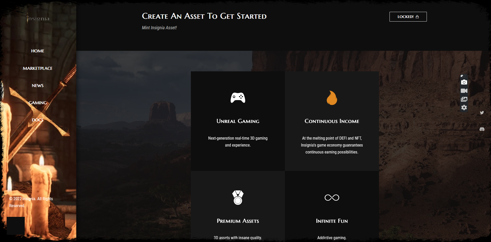
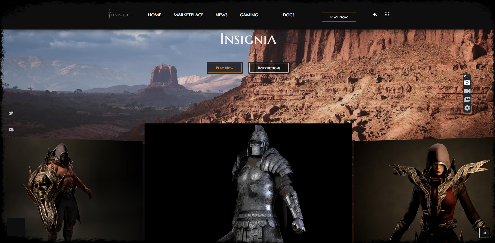

# INSIGNIA
### The 3D Military Strategy Game That Pays To Play.

## Overview
Insignia is a 3D military strategy game that pays to play. A multi-player, play-and-earn game, set in a medieval metaverse and deployed on Optimism:  A low-cost and lightning-fast Ethereum L2 blockchain. Learn more about [Optimism](https://www.optimism.io/)

The ethos of Insignia as a project is maximum fun. Insignia hopes to offer a truly immersive gaming experience and at the same time, provide a rewarding earning potential. The Game-Play, Game Economics, and Tokenomics is such that  ensures a fine balance in sustainability, rewards and enjoyable gaming. The Play-To-Earn model is continously circularly rebalanced to guanranty long term rewards, not only to the early adopters, but to anyone that comes into the Insignia world at any point in time.

## Live Project
See the here: [Live Version](https://getinsignia.com/)

NB: The asset minting functionality on the live version has been intentianally locked. To test out the functionality of the current state of the project, please follow the steps below in the "Getting Started" section to run a local version of the project.

## Screenshots

#### Play Now


#### Home Page


## Whitepaper

Please see the [Whitepaper](https://getinsignia.gitbook.io/whitepaper/) for details like the Game Play, Game Economy, Technicals, The Problem, Our Solution e.t.c

## Summary Of The Problem  :rage: :rage: :rage:
Below are some of the problems we have identified through research as the major pain points  of the Play-To-Earn/NFT gaming industry

- Weak or no element of enjoyable gaming due to emphasis on earning.
- Unsustainable game economic models.
- Weak Tokenomics or incompatible with the project model.


## Our Solution :smile: :smile: :smile:

- The ethos of Insignia is fun! We're creating a game with an immersive experience that you would love to play and spend time with even if there were no earning opportunity to it.
- The game economy is designed with sustainability in mind using a Rewards Reserve and Vault Pool.

Further details (problem and solution) can be found in the [Whitepaper](https://getinsignia.gitbook.io/whitepaper/)


## Built With
### NFT
- Optimism
- Solidity
- React
- JavaScript
- IPFS/Filecoin
- Hardhat
- Ethers
- Alchemy
- HTML5
- CSS3
- Bootstrap

### Game
- Unreal Engine 5

## Getting Started

#### Note: The application is deployed on Optimism Goerli testnet

To run a local copy of this application, follow the steps below:

#### Prerequisites
- You must have node installed on your computer. [Download Node.js](https://nodejs.org/en/)

#### Running Insignia Locally
- Go to the "Code" section of this repository and press the green button that says "Code". Copy the URL or the SSH key.
- Go to the terminal and run:
```
git clone https://github.com/george-shammar/insignia-linode.git
```

The URL or SSH are the links copied from the step above.

- If you don't have git installed, you can download this project and unzip it.
- Go to the "Code" tab and click on "Downlaod Zip"
- Change directory into the folder the application is saved. From the terminal, run:
```
cd directory
```
Where "directory" is the name of the folder.

- Once you have the local copy in your desired folder, go back to your terminal and run:
```
npm install
```
This command installs all the dependencies of the application.

To open up the application in your browser, run:
```
npm run dev
```
It will take a few minutes (usually less than 3 minutes) for the build process to be completed at first build. 
The application should open up at http://localhost:3000/ 

## Usage

- You may explore the entire application. 
NB: Most part of the application are still being actively developed so placeholders are still being used in some parts of the website.
- Click on the "Play Now" tab.
- Click the "Connect Wallet" button and connect to your metamask wallet by choosing an address to connect with. If metamask is not installed on your browser, you'll be prompted and redirected to the metamask download page.
- Select "Optimism Goerli Testnet" network on metamask.
- Click the "Mint Now" button.
- There are on-screen instructions about the status of the transaction. 
- Upon successful confirmation of the transaction, the ipfs metadata of the asset is displayed for the users.


## 🤝 Contributing

Contributions, issues and feature requests are welcome!

## Show your support

Give a ⭐️ if you like this project!
